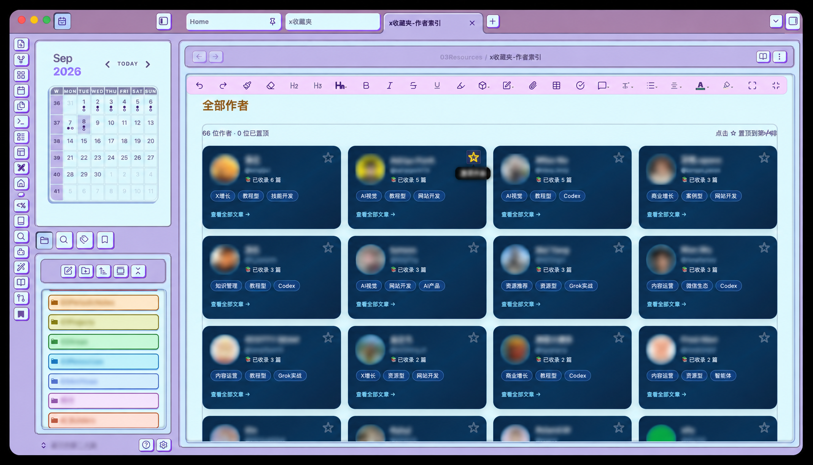
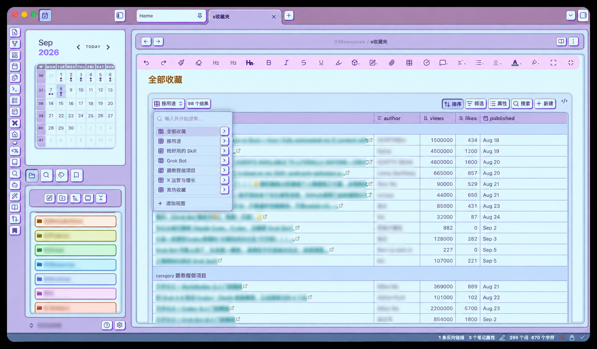

# X 收藏夹 → Obsidian

把浏览器插件导出的 X（Twitter）收藏 CSV，自动整理成一个清楚、可搜索、可分类的 Obsidian 收藏库。

它不只是把链接搬进 Obsidian，还会根据你真正收藏的内容，回答两个更实用的问题：

- 这篇内容以后可以拿来做什么？
- 我为什么值得再次查看这位作者？

## 最终效果

完成后，你会得到三套互相关联的入口：

1. **文章收藏库**
   - 自动去重
   - 按实际用途分类
   - 标题可以直接跳回原 X 帖子
   - 可以按作者、分类、浏览量和互动量筛选

2. **作者卡片库**
   - 一排四张横向卡片
   - 圆形作者头像
   - 作者名与 X ID
   - 已收藏文章数量
   - 从收藏内容中提炼的精准短标签
   - 点击星标后置顶到第一排
   - 点击“查看全部文章”进入作者页

3. **学习与实践工作台**
   - 每天查看昨日新增和历史未读
   - 把内容分流为待学习、待实践、实践中或归档
   - 给重点内容设置优先级、下一步行动和提醒日期
   - 关联独立的学习/实践笔记，并记录最终结果

## 效果预览

### 作者卡片与置顶



### 按用途浏览收藏文章



## 使用前准备

你需要：

- 一个支持 Skill / Agent Skills 规范的 AI Agent（Codex、Claude Code、Cursor、CodeBuddy 等均可）
- Python 3.9 及以上（仅用到标准库，无需 pip 安装）
- 一个已有的 Obsidian 仓库
- 从 X 收藏页导出的 CSV 文件
- Obsidian Dataview 插件（作者卡片和星标置顶需要）

本 Skill 不依赖任何特定 Agent 的私有能力，只要该工具会读取 `SKILL.md` 并执行本地命令，就可以直接使用。

如果没有安装 Dataview，文章 Base 数据库和普通作者笔记仍然可以使用，只是没有交互式作者卡片。

## 第一步：从 X 导出收藏

1. 在 Chrome 登录自己的 X 账号。
2. 打开 [X Bookmarks](https://x.com/i/bookmarks)。
3. 使用自己信任的网页表格抓取或数据导出插件。
4. 让插件持续滚动，尽量加载完整个收藏列表。
5. 导出为 UTF-8 编码的 CSV。

CSV 至少需要包含：

- 帖子原链接
- 作者名
- 作者 X ID
- 帖子正文或标题
- 作者头像 URL

作者主页、发布时间、文章摘要、回复、转发、喜欢和浏览量属于可选字段。Skill 也兼容部分浏览器抓取插件生成的 `css-xxxx` 类型列名。

> 不需要导出 Cookie、密码、Token 或其他登录凭证。

## 第二步：安装 Skill

把整个 `x-bookmarks-to-obsidian` 文件夹放进你所用 Agent 的 skills 目录：

| Agent | 安装位置 |
| --- | --- |
| Codex | `~/.codex/skills/x-bookmarks-to-obsidian` |
| Claude Code | `~/.claude/skills/x-bookmarks-to-obsidian` |
| Cursor | `~/.cursor/skills/x-bookmarks-to-obsidian` |
| CodeBuddy / WorkBuddy | `~/.workbuddy/skills/x-bookmarks-to-obsidian` |
| 其他支持 Agent Skills 的工具 | 该工具文档指定的 skills 目录 |

也可以按项目安装，例如 `<项目根目录>/.claude/skills/x-bookmarks-to-obsidian`，只对该项目生效。

目录结构应当是：

```text
x-bookmarks-to-obsidian/
├── SKILL.md
├── README.md
├── LICENSE
├── agents/
├── assets/
├── references/
└── scripts/
```

安装后新建一个任务或会话。如果没有立刻出现在 Skill 列表中，请重启该 Agent。

## 第三步：让 Agent 整理收藏

把导出的 CSV 附给 Agent，然后发送：

```text
使用 $x-bookmarks-to-obsidian 整理这份 X 收藏 CSV。
先去重，再按实际用途分类，保存到我的 Obsidian，名称叫“x收藏夹”。
保留原文链接，并生成带头像、精准标签和置顶功能的作者卡片页。
```

如果 Agent 无法自动确认 Obsidian 仓库位置，再补充仓库的完整路径即可。

## 会生成哪些文件

默认会在 Obsidian 仓库根目录下的 `X收藏夹` 文件夹中生成：

```text
X收藏夹/
├── x收藏夹.md
├── x收藏夹.base
├── x收藏工作台.md
├── x收藏工作台.base
├── x收藏夹条目/
├── x收藏夹-作者索引.md
├── x收藏夹-作者索引.base
├── x收藏夹作者/
└── x收藏夹作者头像/
```

想放到别的位置，直接告诉 Agent，或让它在命令里加 `--output-folder`：

```text
保存到我的 Obsidian，放在“我的资料”文件夹下，名称叫“x收藏夹”。
```

其中：

- `x收藏夹.md` 是文章总入口。
- `x收藏夹.base` 是可筛选的文章数据库。
- `x收藏工作台.md` 是每天处理未读、提醒、学习和实践的入口。
- `x收藏工作台.base` 提供完整的内容管道视图。
- `x收藏夹-作者索引.md` 是作者卡片入口。
- `x收藏夹作者/` 保存每位作者及其全部收藏文章。

> 如果你用过旧版本、收藏库在 `03Resources` 下，Skill 会自动沿用旧位置，不会重复生成第二份。
> 想迁移到 `X收藏夹` 时，显式指定输出文件夹即可。

## 分类逻辑

文章不会只被分成宽泛的“AI”或“科技”，而是优先按照用途整理，例如：

- X 运营与增长
- 内容与自媒体
- Obsidian 与知识库
- AI Agent 与自动化
- Skill 与插件
- AI视觉
- 视频、剪辑与动效
- 商业获客与变现
- 教程与项目
- AI 趋势与资源

作者标签则从你收藏他的文章中综合提炼，每位最多三个、每个最多六个字，例如：

```text
AI视觉 · 教程型 · Codex
X增长 · 资源型 · 提示词
内容运营 · 案例型 · 微信生态
```

## 日后更新收藏夹

重新从 X 导出最新 CSV，然后把文件交给 Agent：

```text
使用 $x-bookmarks-to-obsidian 更新我的“x收藏夹”。
合并这份新 CSV，继续去重并保留我已经置顶的作者。
```

更新时会：

- 根据 X 帖子 ID 去重
- 更新已有的托管条目
- 增加新的收藏文章和作者
- 保留作者的 `pinned` 置顶状态
- 保留每篇内容的处理状态、优先级、提醒日期、下一步行动和实践结果
- 只让首次出现的新收藏进入“未读”，不会把旧内容重新设为未读
- 不删除用户自己创建的其他笔记

## 手动运行（可选）

通常只需要在 Agent 中调用 Skill，不需要手动执行脚本。

预览 CSV，不写入文件：

```bash
python3 <SKILL安装目录>/x-bookmarks-to-obsidian/scripts/build_x_bookmarks.py \
  --input "/绝对路径/x-bookmarks.csv" \
  --vault "/绝对路径/你的Obsidian仓库" \
  --dry-run
```

首次生成：

```bash
python3 <SKILL安装目录>/x-bookmarks-to-obsidian/scripts/build_x_bookmarks.py \
  --input "/绝对路径/x-bookmarks.csv" \
  --vault "/绝对路径/你的Obsidian仓库" \
  --name "x收藏夹"
```

更新已有收藏库：

```bash
python3 <SKILL安装目录>/x-bookmarks-to-obsidian/scripts/build_x_bookmarks.py \
  --input "/绝对路径/x-bookmarks.csv" \
  --vault "/绝对路径/你的Obsidian仓库" \
  --name "x收藏夹" \
  --update
```

常用参数：

| 参数 | 说明 |
| --- | --- |
| `--name` | 收藏库名称，默认 `x收藏夹` |
| `--output-folder` | vault 内的输出文件夹，默认 `X收藏夹` |
| `--dry-run` | 只预览，不写文件 |
| `--update` | 增量更新已有收藏库 |
| `--no-download-avatars` | 不联网下载头像，全部使用默认头像 |

## 常见问题

### 为什么头像没有显示？

可能是 CSV 没有头像 URL，或者下载头像时网络不可用。Skill 会自动使用默认头像，不影响文章整理。

### 为什么没有作者卡片？

请确认 Obsidian 已安装 Dataview，并在 Dataview 设置中开启 JavaScript Queries。

### 为什么 Skill 拒绝覆盖已有文件？

这是为了保护用户原有笔记。Skill 默认只更新带有 `generated_by: x-bookmarks-to-obsidian` 标记的托管文件。

### 会下载收藏帖子的图片和视频吗？

不会。这个 Skill 只整理 CSV 中的文字、元数据、作者头像和原文链接，不自动下载帖子媒体。

### 会操作我的 X 账号吗？

不会。整理阶段只处理本地 CSV。只有用户明确要求 Agent 协助浏览器导出时，才会读取当前登录账号的收藏页面，并保持只读。

## 隐私说明

X 收藏属于私人数据。请将 CSV 保存在自己的电脑或可信存储中，不要上传到公共网盘、临时分享网站或公开仓库。

本 Skill 不读取或保存 Cookie、密码、Local Storage 与访问令牌，也不会执行点赞、转发、关注、评论或发布操作。

README 自带的演示截图已经模糊作者头像、姓名、账号、真实文章标题、仓库名称和文件夹名称，只保留界面结构与功能信息。自行替换截图时，也应检查这些区域，避免公开个人收藏偏好。

## 作者

**孙可可**（[sunkeke-ai](https://github.com/sunkeke-ai)）

如果这个项目帮你整理好了收藏夹，欢迎在 GitHub 上点个 Star，或分享给同样被 X 收藏夹淹没的朋友。

## 版权与许可

代码与文档版权归 **孙可可** 所有，采用 [MIT License](LICENSE) 开源发布。

简单说，你可以：

- 免费使用、复制、修改、合并、发布和分发本项目
- 用于商业用途
- 再许可和出售副本

唯一的要求是：**在所有副本或重要部分中保留本项目的版权声明和许可声明**。

项目按「原样」提供，不作任何担保，作者不对使用本项目产生的任何问题负责。

> 注意：本 Skill 只整理你自己导出的收藏数据。X / Twitter 上的推文内容版权归原作者所有，本项目不主张任何权利。
